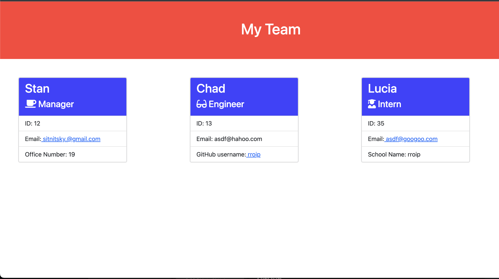

# Team Generator

## Description

This is a simple Team Generator application to assist the user with creation of their own dream team file database. 

The application can be invoked by node index.js or npm start command and follow through the questionere.

User can choose a manager, engineer and intern, adding their info to the profice and generate an HTML page database with working links to their emails and GitHub. 

## Installation
> npm install --save inquirer  
> npm install jest

## Test 
The application uses Jest for running the tests. Use the following command:  
> npm test
## Usage
The Team Generator will be invoked by using the following command:  
> npm start

## Screenshots/Video

Video presentation of application [Team Generator](https://drive.google.com/file/d/10cU_oo5E6gyr7cRjhcnXzVm2-7fQTaBh/view)

Repo for app can be found at https://github.com/rroip/Team-Generator
